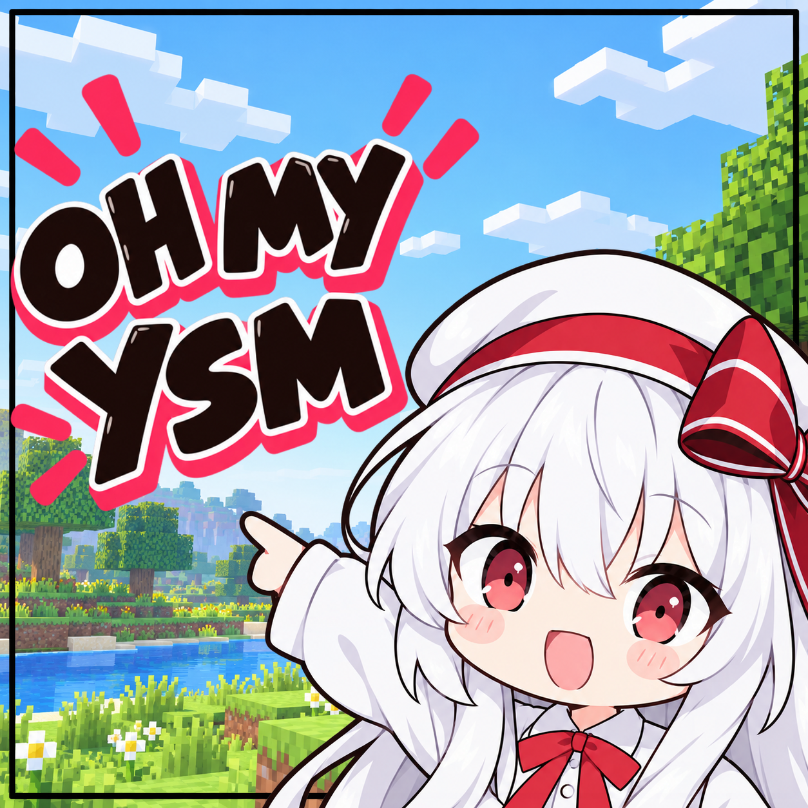
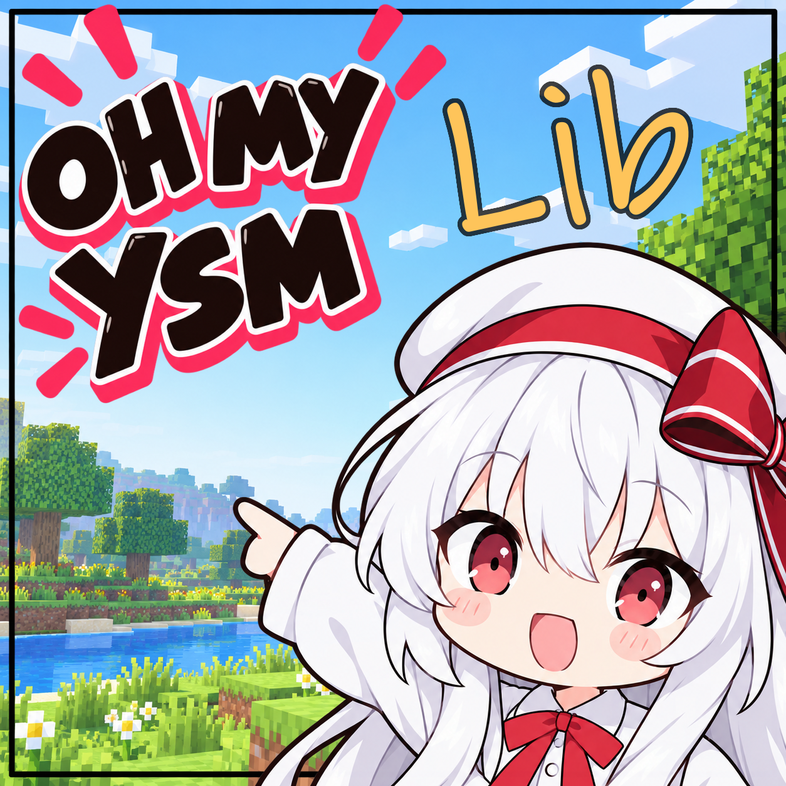

# Oh My Yes Steve Model

<div align="center" style="display:flex; justify-content:center; gap:20px;">
  
  
</div>

> 您可以根据[主许可证](./LICENSE)自由处理项目的资源 除了两个图标 它们使用[受限许可证](./LICENSE-ARTWORK.md) 如果您需要修改图标 请不要派生，而是直接替换他们，许可证赋予您分发的权利，但是不允许修改。
---
一个带有一堆修补和额外功能的YSM3.0分支 用以移植到1.12 为1.12带来YSM/CPM和MMD/VRC模型支持（在可预见的未来 YSM3.0官方版本永远不会提供这类支持）
用Oh My YSM Lib 替换传统的YSM Native环境 提供可插拔的Native加速和基础的Java渲染支持

Oh My YSM Lib 允许您组合一个其他的*3D模型格式和oysm映射json文件来将这个模型描述为YSM模型，未来可能提供一个编辑器完成绑定，当前绑定依然需要手工进行，但是一个足够强大的agent工具可以为您完成大部分粗略的绑定。

**OhMyYSMLib可能于YSM3.0推出后以Mixin的形式为官方编译版本YSM添加OhMyYSM的所有功能，但是这个计划不确定，我们不确定会在可预见的未来为高版本用户提供足够的支持。如果您觉得这很糟糕，或许可以联系我们，参与开发计划。**

| 组件 | 状态 |
|---|---|
|YSM Native替代（Oh My YSM Lib|完成传统YSM Native的大部分功能|
|CPM模型支持|Plan|
|Oh My YSM MMD|Demo|
|Oh My YSM VRC Inport tool|Plan|
|纯Java物理|远期|

其他计划
- 拆分关于通用模型渲染的功能到Lib
- 重写联机协议

主要计划
- 1.12移植
- 修补大部分Bug
---
ai sloop分割线
---

**鬼故事 上游也不稳定 且硅基话 我懒得且没时间写人肉文档了 看不明白直接呼叫agent吧**

本 fork 的正式全称是 **Oh My Yes Steve Model**，简称 **Oh My YSM**；其中 YSM 延续 Yes Steve Model 的缩写，便于兼容既有模型、协议和 API。带有两个可安装 JAR 的自动构建发布于 [本 fork 的 Releases](https://github.com/AndreaFrederica/OhMyYesSteveModel/releases)；YSM 本体和 Oh my ysm lib 必须一起放入 `mods/`。构建方式与可选 native 加速的安装见[构建指南](docs/build.md)。

本 fork 使用独立前置 **Oh my ysm lib**（`ysm_runtime`，作者 AndreaFrederica）替代官方 YSM native。编译、内置资源生成和运行都接入我们的库；各能力提供 JVM 基线，可用的自建 native 优先加速。当前 native 覆盖 BLAKE3、zstd 和 packed 顶点输出，其余能力仍使用 JVM。

## 我们的特性与理念

**功能由 JVM 基线保证，native 负责可选加速。** 没有加速库时仍应使用相同的模型功能，而不是停用模型或只显示默认玩家；有可用加速时优先使用加速。完整功能迁移是目标，已经完成的验证范围单独公开，不以“能启动”代替功能验收。

| 部分 | 功能 |
|---|---|
| YSM 主体 | Minecraft / Forge 接入、模型与资源生命周期、动画、网络同步、游戏渲染和命令；编译与运行均通过我们的前置，不再要求官方 YSM native |
| Oh my ysm lib | 独立前置 Mod 与可复用 Java 17 算法模块，命名空间 `cc.sirrus.ysmlib`；接口、JVM 实现与可选 native provider 分开，算法模块不依赖 Minecraft |
| 模型与格式 | V1/V2 原始归档与 V3 编译格式保持独立；V3 按内容哈希复用已转换模型和 V3D 解压缓存，避免每次启动重新导入；提供归档、BLAKE3、zstd 与 V3D 工作区工具 |
| 图像与声音 | PNG/JPEG/WebP/AVIF/ZTX 解码、ZTX 编码、Ogg Opus/Vorbis 解码；AVIF 使用 Chicory 在 JVM 内执行 WASM，无宿主 JNI 解码依赖 |
| 渲染 | JVM 烘焙与帧状态，Java / C++ packed 顶点输出；已恢复左右手、独立背景模型和通过 FirstPerson 驱动的全身兼容 |
| 使用与调试 | 后台模型处理与 V3D 导出，游戏指令和独立 CLI；F3 显示前置版本与各能力当前 provider，回退情况如实显示 |

我们坚持以下边界：

- **模块化替代**：每个能力有清晰接口，宿主负责游戏对象、Catalog、网络与 GPU 生命周期，算法库不接管这些业务状态。
- **托管实现优先建设**：优先 Java/Kotlin；只有缺少合适 JVM 语言实现时才接受纯 JVM/WASM 兜底。WASM 是可移植基线的一部分，不冒充 native 加速。
- **运行时加速优先**：通过自检的自建 native 优先提供对应能力；没有制品、加载失败或可恢复的加速故障，只回退相应能力，其他模块继续工作。
- **编译期也独立**：资源生成、校验和正常构建由我们的库驱动，不通过跳过内置资源生成来绕开官方 native。
- **语义一致、验证透明**：JVM 与 native 应产生一致的格式和可观察行为；测试区分纯 JVM、真实 native 和尚未验收的第三方组合。替代的是官方 YSM native，不是 Minecraft 自身的 LWJGL/OpenGL/OpenAL。

## 跨平台：架构能力与验证范围

**理论上支持跨平台运行。** Oh my ysm lib 的托管基线面向 Java 17，不要求目标系统具备对应的 YSM DLL、SO 或 dylib，也不继承官方 native 的 CPU 指令集检查。平台或 CPU 架构缺少我们的 native 加速包时，应自动使用 JVM 实现。因此 Windows、Linux、macOS，以及具备适配 JVM 与游戏运行环境的 ARM64 设备，都具有移植路径。

这不意味着所有平台已经实机验证，也不意味着一个 DLL 能跨平台使用：

| 层次 | 前提与当前状态 |
|---|---|
| 独立算法库 / V3D CLI | 需要兼容的 Java 17 JVM；普通使用不需要 Minecraft 或官方 native。AVIF 的 WASM 引擎也在 JVM 中运行 |
| YSM Forge Mod | 还需要目标平台能运行 Minecraft 1.20.1、Forge 及其图形/音频组件；JVM 可移植性不自动解决驱动、启动器和第三方 Mod 兼容 |
| 自建 native 加速 | 必须匹配 OS / CPU / ABI；当前工具链配置含 Windows x64、Linux x64、macOS ARM64，构建目标不等于游戏支持声明 |
| 已完成实机验证 | **Windows x64、Java 17、Forge 47.4.3**：纯 JVM 与自建 native 场景，包括 FirstPerson 2.2.3 的身体/双手/视角切换及独立服务器与双客户端流程 |
| 尚待验证 | Linux、macOS、Android/社区启动器、其他架构、旧版 Windows 和更多 shader / Mod 组合；目前不承诺这些环境开箱即用 |

我们的方向是让 native 成为性能选择，让平台适配不再被官方 YSM native 制品是否存在所阻塞。具体平台基线和验证缺口以[支持状态](docs/status/support-and-verification.md)为准。

## 后台模型加载

进入世界后自动扫描 `ysm/custom`，无需打开模型文件夹触发。屏幕加载条显示文件发现、处理进度、等待队列、错误和收尾状态；按需资源加载单独统计。模型界面 → 设置 → **后台模型加载** 可调整并发、扫描预取量和每 tick 提交预算，关闭设置页后自动保存。默认冷加载扫描 1 个线程、客户端加载 2 个线程；V3 成品缓存命中通过独立后台通道推进，不占冷加载预取槽位，仍保留分批发布预算。以降低后台工作对游戏帧率的影响为目标，更低的负载通常也意味着更长的加载时间。软预算不能拆分单次大纹理上传，实际流畅度仍需在对应模型集上验证。

## 构建与安装

从源码构建和安装请看 **[构建指南](docs/build.md)**；库的模块划分见 **[runtime/README.md](runtime/README.md)**。当前对接本仓库的 YSM fork，尚不支持直接替换未经修改的官方 Mod。已验证范围和未完成项见[当前支持状态](docs/status/support-and-verification.md)。

使用 JDK 17，在 PowerShell 中克隆并构建：

```powershell
git clone --branch feature/v3d-decoded-cache https://github.com/AndreaFrederica/YesSteveModel.git
cd YesSteveModel
.\gradlew.bat -p runtime build
.\gradlew.bat build '-Pysm.fast_run=true'
```

安装本体 `build/libs/ysm-3.0-dev-forge+mc1.20.1.jar` 和前置 `runtime/forge/build/libs/ysm-runtime-forge-0.1.0.jar`。可选 native、FirstPerson 和开发启动步骤见构建指南。

## ⚠️ 警告

当前公开版本还未完成，不保证稳定性、数据安全、跨平台行为、API、代码结构或后续版本兼容性。请勿用于生产环境或重要存档，测试前务必备份游戏目录、世界和模型。

所有公开格式、Schema、内部协议和缓存布局均尚未冻结，在正式发布前大概率会有 break change，并且不做向后兼容。

## 项目状态

本项目正在进行大规模重构，目前公开代码主要用于审阅、协作和验证设计。

目前仅协作者可贡献代码，如有贡献意愿可加入 YSM 开发者交流群了解详情。须知当前代码结构还未稳定，贡献者的本地开发进程可能得跟着主线一起重构。待模型管理和网络协议完成开发、旧版能力完成迁移，将会开放贡献。

更多信息见 [迁移概览](docs/migration-overview.md) 

## 与旧版相比

| 类别     | 重点                                                                                                                                                    |
| ------ |---------------------------------------------------------------------------------------------------------------------------------------------------------|
| 新增能力   | 公开的模型资产标准；细粒度资产分发；动态资源管理；更多平台支持。                                                                                        |
| 既有能力改进 | 模型业务回归 Java，native 收缩为能力层；内容身份、连接、资源所有权、失效和恢复边界显式化。                                                              |
| 兼容验收   | 左右手、背景模型和 FirstPerson 全身兼容已恢复，并完成 JVM/native 代表性实机验证；其他附着 layer、第三方模组与 shader 组合仍需逐项验收。 |
| 迁移重点   | 完成剩余模组联动与 layer 验收、扩展加速覆盖、验证更多平台；旧系统和 CPU 的实际可用性仍需 JDK / 游戏环境与实机验证。 |
|        |                                                                                                                                                         |
| 未来方向   | 模型签名、通用外部模型源、GPU Compute Pipeline、独立 Backend。                                                                                |

## 文档

- [完整索引](docs/README.md)
- [构建指南](docs/build.md)
- [术语表](docs/glossary.md) / [文档政策](docs/governance/documentation-policy.md)
- [独立格式标准](docs/standards/README.md)
- [产品决策](docs/product-decisions/README.md)
- [架构总览](docs/architecture/README.md) / [运行模型](docs/architecture/runtime-model.md)
- [当前支持状态](docs/status/support-and-verification.md)

## 许可证

- 除另有声明的内容外，本仓库的原创代码按 [Apache License 2.0](LICENSE) 开源。
- Asset Container Spec、Model Schema、规范性 Proto 快照及一致性要求是独立于 YSM 和 Minecraft 的标准，按 [CC0 1.0 Universal](LICENSES/CC0-1.0.txt) 发布。
- 内置模型资产不属于 Apache-2.0；每个资产目录中的 `ysm.json` 是其许可证的权威清单。
- 主 Mod 和 Lib 的图标保留版权，单独适用 [图标授权协议](LICENSE-ARTWORK.md)。允许随本项目及其分叉版本分发、在启动器和介绍页面展示；创作性修改或作为其他项目的标识使用需另行授权。项目名称可自由使用，不受图标协议限制。
- 项目包含直接拷贝或修改的第三方代码以及随包依赖，详见[NOTICE.md](NOTICE.md)。

Apache-2.0 不覆盖上述独立标准、内置资产、图标或第三方作品；对应文件中的单独声明优先。
