# 架构总览

YSM 的业务权威位于 Java 领域层：模型来源、身份、授权、发布、实体动画与资源生命周期均由其裁决。

计算类能力交由独立前置 **ysm_runtime**（显示名 *Oh my ysm lib*）承担：归档、编解码、图像、音频、V3 导入、烘焙与 CPU 顶点。该层只消费明确的 bytes、几何与骨骼状态，计算完成后返回结果，不持有模型目录、网络会话或 GPU 生命周期。

Minecraft / Forge 保有游戏事实、连接与 GPU 提交环境。

格式、协议与运行行为目前均为 **unstable**，不应视为稳定契约。业务选择的权威入口是[产品决策](../product-decisions/README.md)。

文档归约、唯一落点与引用闭环见[架构文档维护规则](maintenance.md)。

## 按问题选择入口

下表中的 Java 包名以 `com.elfmcys.ysm` 为前缀；ysmlib 使用 `cc.sirrus.ysmlib`。符号用于定位职责边界，内部方法不因此成为公开 API。

| 要解决的问题 | 首读 | 主要定位符号 |
|---|---|---|
| 启动、换服、退出、worker 与 owner thread | [运行模型](runtime-model.md) | `event.CommonEvent`、`ClientModelService`、`ServerModelService` |
| Raw、archive、历史内容如何变成当前模型 | [资产管线](asset-pipeline/README.md) | `format.parser.ModelParser`、`model.catalog.ModelSourceResolver` |
| 元数据可读却不能加载目标资源 | [容器与分层验证](asset-pipeline/container-and-validation.md) | `ModelFileIdentityReader`、`ModelFileView`、`ChunkDataSource` |
| 哪个模型可见、是否 Ready、谁保活资源 | [模型管理](model-management/README.md) | `model.catalog`、`model.session`、`client.model.internal` |
| 哪条连接裁决、分片何时完成、谁调度发送 | [网络](network/README.md) | `network.NetworkHandler`、`network.forge`、`ResourceDispatchWorker` |
| 动画状态、Molang、骨骼输出为何变化 | [动画](animation/README.md) | `AnimatableEntity`、`IAnimationController`、`AnimationProcessor` |
| 几何烘焙、帧调度、顶点或透明排序 | [渲染](rendering/README.md) | `BakeProvider`、`Renderer`、`ModelState`（ysmlib） |
| 前置接入、加速选择、JVM 基线边界 | [独立前置与迁移](native-runtime/portable-runtime.md) | `YsmRuntime`、`cc.sirrus.ysmlib.*` |
| 模型卡、预览、翻页、选择与页面资源 | [客户端展示](client-presentation/README.md) | `client.gui`、`ClientAssetBatch`、`EntityModelBinding` |
| Forge 接入、第三方扩展、locator 与 render hook | [游戏与扩展接入](integration/README.md) | `api`、`client.compat`、`GeoReplacedEntityRenderer` |

## 主数据流

```mermaid
flowchart TB
    SOURCE["本地来源"] --> FORMAT["Java 转换与校验"]
    FORMAT --> LOCAL["本地目录与存储"]
    LOCAL --> SERVER["服务端会话权威"]
    SERVER --> NET["类型化发布与资产传输"]
    NET --> READY["客户端激活与 Ready 内容"]
    LOCAL --> READY
    READY --> TARGET["渲染目标与租约"]
    TARGET --> ANIM["Java 实体动画"]
    GAME["实体 / 世界 / 同步输入"] --> ANIM
    ANIM --> EXTRACT["状态提取"]
    TARGET --> BAKE["几何烘焙"]
    BAKE --> EXTRACT
    EXTRACT --> VERTEX["CPU 顶点输出"]
    VERTEX --> DRAW["Java 适配 / Minecraft 绘制"]
    READY --> UI["客户端目录展示"]
    UI --> INTENT["选择意图"]
    INTENT --> SERVER
```

图中的 remote 路径只在相应 session authority 生效时使用。Local 模式的选择与资源取得见[玩家状态](network/player-state.md)和 [Catalog 与来源](model-management/catalog-and-sources.md)。Catalog、activation、render-target Ready 与当前 draw 是不同发布边界，不能由某一阶段成功推断后续阶段已经可用。

## 跨边界约束

- 公共 bytes 的含义由 [Asset Container](../standards/asset-container.md)、[Model Schema](../standards/model-schema/README.md)和[协议](../standards/protocol-v1/README.md)定义；实现页不重新定义 wire 字段。
- 模型身份、精确 representation 与 session authority 彼此独立。对象级关系由[模型管理](model-management/README.md)统一说明，计算层只借用已确定的输入。
- 消费者通过租约保活完成资源；临时计算调用、页面取消和连接退出有各自的生命周期。完整关闭规则只在[所有权与生命周期](model-management/ownership-and-lifecycle.md)定义。
- CPU renderer 不是独立游戏后端，也不提交 GPU draw。能力存在不等于对应模型功能已接通；支持结论只看[当前支持状态](../status/support-and-verification.md)。

图中相邻模块不意味着可以共同写入同一份 mutable state。
