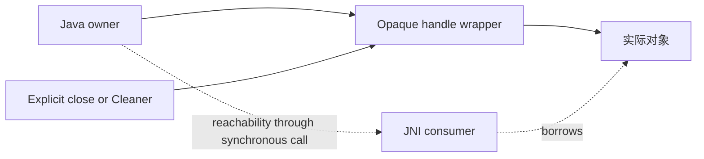

# 计算边界与内存

跨语言值主要有两类：调用期间借用的 bytes，以及需要显式保活的对象。Java wrapper、NIO view 与底层 backing 的生命周期必须分别辨认；raw address 和 `jlong` 自身都不提供所有权证明。领域层的唯一关闭责任与 Cleaner 规则见[所有权与生命周期](../model-management/ownership-and-lifecycle.md)。

> 当前生产路径为纯 Java 实现。下述 buffer 与句柄约定对「本体适配层 ↔ ysmlib 能力」以及未来可选 native 加速同样适用。

## Buffer 传递

`buffer.UniBuffer` 统一 array 与 native memory 的访问。

| 形式 | 实现机制 | 使用边界 |
|---|---|---|
| Array input | 默认使用 critical array；safe 变体复制到受控 cache | Critical 区间必须限定在对应同步操作内，不得把所得地址保存给延迟工作 |
| Direct input | 校验 offset/size 并取得地址 | 不复制 backing；原 owner 必须持续可达，不能把 NIO view 存活等同于 owner 存活 |
| Owning output | 输出 array 或转移 native allocation | 与分配方式配对释放 |
| Archive file view | 默认借用 Java array | 下一次读取或 owner 关闭使借用失效；跨读取或异步保留需复制 |

`slice()` 不增添独立 ownership token，`acquire()` 取得独立引用，`copy()` 复制 bytes；它们不能互换。Borrowed view 不注册 cleanup，也没有释放 backing 的权利。显式 close 与 Cleaner 汇合到同一个 exactly-once action。

## Protobuf bytes seam

Java 内部可以共享 immutable generated message，但能力边界不暴露 QuickBuffers 类型。调用前先把 message 序列化到由 Java 明确拥有的 protobuf bytes，再按上节的 buffer 契约在同步调用期借出；generated `Builder`、parse cursor 与 allocator 都不是 ABI。

序列化临时 buffer 的 owner 必须活到调用返回，返回的 opaque handle 或 owning output 再按各自协议保活和关闭。Malformed bytes、实现返回失败与 Java wrapper/handle 失败分别保留各自结果语义，不能用 partial message 或裸 pointer 绕过。

## Opaque handle

普通对象 handle 使用类型化 shared ownership。类型检查能拒绝空值与类型不符，但不能验证一个任意非空地址是否已被销毁；Java 侧 `get()` 因而必须先拒绝已关闭对象。

并非所有 handle 都采用这套表示：archive adapter 有自己的 proxy 和 destroy，legacy result 也有独立 payload 所有权。只能调用对应类型的释放入口，不能统一交给通用 opaque destroy。

音频 decoder handle 使用专属协议：每次播放独占创建，以 direct input 分段 `feed`，输入耗尽后只调用一次 `endInput`，再用 direct destination `read` 到精确 EOF 或错误。Handle 不进入 pool，也不跨播放共享 cursor；显式 `close` 与 Cleaner 汇合到同一原子 destroy。每次调用都 fence decoder owner 和对应 direct buffer，防止调用期间 backing 被回收；fence 不允许并发 close/use。

## 失败与回收

- 调用返回成功不代表外部状态已提交。渲染完成后才由 Java 写入 `VertexConsumer`；模型 Ready 与纹理发布始终由 Java 资源 owner 决定。
- 临时输出由固定 owner 释放，避免容量敏感对象等待 Cleaner。
- 逻辑关闭（不再接受新调用）与物理回收（内存实际释放）是两个独立阶段，均须闭环。
- 段错误或内存破坏不能靠 JVM fallback 恢复。
