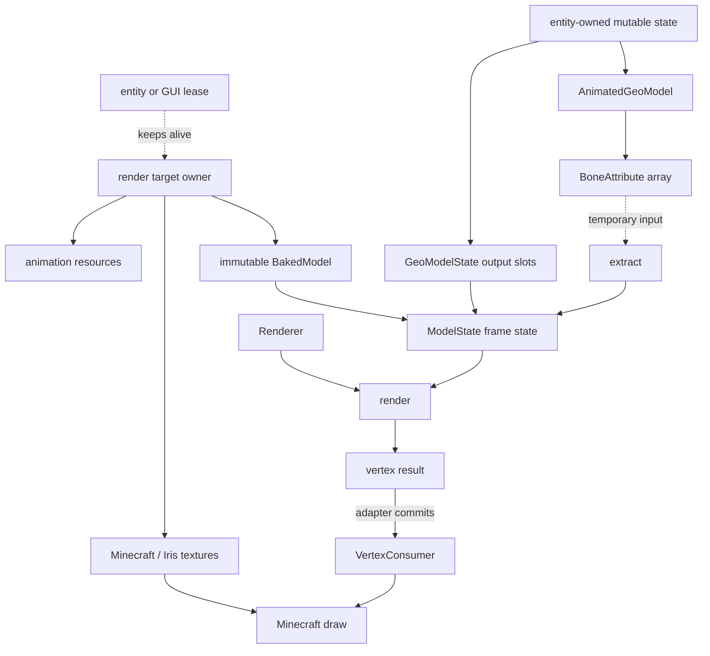

# 渲染架构

渲染分为三个阶段：**bake**（将几何烘焙为可绘制数据）、**extract**（提取当前帧骨骼状态）、**render**（计算顶点并交由 Minecraft 绘制）。

算法实现位于独立前置 ysm_runtime（`render-api` / `java-bake` / `java-render`）。本体只调用能力接口，并将结果适配到 Minecraft 的 `VertexConsumer`。

GPU draw 不属于本主题。动画脚本语义见[动画](../animation/README.md)，尚未实现的 GPU 方向见 [GPU Compute Renderer](../../future/gpu-compute-renderer.md)。

## 责任边界

| 参与方 | 当前所有权与职责 | 不拥有 |
|---|---|---|
| Java 模型与渲染接入 | render target、`ResourceLease`、`GeoModelState`、纹理、`entity` / `level`、`PoseStack` 和 `RenderContext`；选择 `RenderType`，取得 `VertexConsumer`，发起 bake / extract / render | 顶点计算、内部数据布局、GPU draw |
| ysm 渲染能力（ysmlib） | `BakedModel`、`ModelState`、`RenderSchedule` / `RenderTask`；静态烘焙、骨骼层级、逐帧状态提取、CPU 调度、变换、面剔除、透明排序和顶点生成 | catalog、纹理对象、Minecraft render state、GPU resource |
| Minecraft / Iris | `RenderType`、`MultiBufferSource`、`VertexConsumer`、纹理注册、批处理、上传和 draw | 模型来源、`BakedModel`、动画状态 |

Target 由[ResourceLease](../model-management/ownership-and-lifecycle.md)保活；[Processor](../animation/processor-and-bone-output.md)写骨骼属性，[帧执行](frame-execution.md)拥有输出槽、借用与失效规则。

## 三阶段契约

| 阶段 | 频率与执行位置 | 输入 | 输出 |
|---|---|---|---|
| bake | 模型或影响烘焙的资源变化时；后台构建路径 | 几何、基础纹理 alpha、UV 约定和 `BakeModelOptions` | 不可变 `BakedModel`；可选 serialized baked cache |
| extract | 每个需要新动画结果的 `entity` 与 `RenderContext`；主路径可在 Java worker | `BakedModel` 与 `BoneAttribute` | 有效 `ModelState`、pose / render-bone view、locator indices 和 `RenderSchedule` |
| render | Minecraft 渲染线程发起 | `ModelState`、`RenderParameters`、`VertexKind` 与目标输出区间 | 成功后提交到 `VertexConsumer`，再由 Minecraft 上传和 draw |

阶段名描述数据依赖，不保证固定线程。渲染计算 worker 不执行动画求值或 extract；具体线程与同步边界见[逐帧状态与调度](frame-execution.md)。

## 子主题

- [渲染决策理由](design-rationale.md)：能力边界、派生 cache 身份与共享 residency 取舍。
- [Bake、分区与 cache](bake-and-partition.md)：`BakedModel`、切线烘焙、四逻辑分区和 AoSoA。
- [逐帧状态与调度](frame-execution.md)：extract、可见性、附着点、任务拆分与低延迟同步。
- [CPU render 与顶点输出](vertex-output.md)：矩阵、剔除、normal / tangent、`RenderType`、`VertexConsumer`、输出区间、透明排序。
- [GPU Compute Renderer](../../future/gpu-compute-renderer.md)：尚未实现。
- [渲染已知问题](../../status/known-issues/rendering.md)。

## 本体适配层定位

| 要检查的边界 | 本体入口（过渡适配名） | ysm_runtime 能力 |
|---|---|---|
| 资源到静态几何 | `natives.render.NativeBakedModel` | `BakeProvider` / `BakedModel` |
| 骨骼数组到帧状态 | `GeoModelState`、`natives.render.NativeModelState` | `ModelState.extract` |
| Draw 到输出区间 | `natives.render.NativeRenderer.render()`、`FallbackVertexWriter` | `Renderer` |

`Native*` 前缀是迁移期保留的命名，其实现为 JVM 适配器，不再加载官方 native。保活与借用规则见[计算边界与内存](../native-runtime/jni-and-memory.md)；可取消绘制窗口见[游戏与扩展接入](../integration/README.md)。

## 第一人称手臂

Forge `RenderArmEvent` 由 `PlayerRenderer.renderRightHand/renderLeftHand` 发出，独立于第三人称的 `RenderPlayerEvent.Pre`。`ReplacePlayerHandRenderEvent` 在 capability、模型和手臂 locator 就绪后调用 `CustomFirstPersonArmRenderer`，只有接管成功才取消原版手臂；不取消整个 `RenderHandEvent`，物品绘制仍由 Minecraft 管理。

手臂实体使用 arm variant 与第一人称动画。`LocatorVisibility` 在 ysmlib 的 render-api 中复制当前骨骼属性，只保留指定 `LeftArm` 或 `RightArm` 子树的几何；祖先变换和动画隐藏标记仍有效，不改写动画输出。每次手臂 draw 重新提取可见性，避免同帧第二只手复用第一只手的状态。缺失资源或 locator 保留原版手臂；有效模型主动隐藏手臂时允许零顶点接管。换玩家、资源重载和退出连接时释放旧手臂状态。

F3 的 `First-person` 行显示最近一次事件结果与接管/事件计数，不逐帧写日志；第三人称或原版不绘制手臂的物品路径可能没有新的 arm 事件。第一人称背景使用独立的 `Background` locator 子树和独立的 `CustomFirstPersonArmEntity` 状态，通过同一个 ysmlib render API 提交；缺失该 locator 时保留原版表现。背景保留旧版相机坐标和 bobbing，按 render tick 去重，不取消手持物事件；其独立动画状态不重复发射手臂动画音效。

卓越前线使用其 `RenderPlayerArmEvent`，保留新旧武器骨骼坐标换算，再进入相同的第一人称 renderer；仅在有可用的 arm locator 和有效输出状态时接管原版手臂。事件修改的矩阵由 push/pop 恢复。可选依赖的类只由对应兼容入口加载。

## 全身第一人称兼容

上游已有的全身第一人称由 FirstPerson 模组发起玩家实体绘制，YSM 在 `RenderPlayerEvent.Pre` 中替换为当前模型。`PlayerAnimatableCapability` 在该遍隐藏 `AllHead`，按 `ViewLocator`（缺失则使用 `Head`）的 pivot 与模型高度比例向 FirstPerson 提供身体垂直偏移；普通绘制恢复头部。这条路径使用同一 ysmlib bake / extract / render 接口，不需要官方 native。

FirstPerson 遍的 `RenderContext.firstPersonMod=true`、`level=false`，以便独立重算动画和隐藏状态。`q.is_first_person` 与 `ysm.person_view` 仍必须识别本机相机视角，不能因为 `level=false` 返回第三人称。GUI 和其他玩家的查询继续使用第三人称语义。

这项兼容能力与 arm 模型的 `Background` 分组是独立路径；模型不会因为定义背景而自动进入全身绘制。安装 FirstPerson 是上游已有使用方式，不是迁移后对官方 native 的替代依赖。
