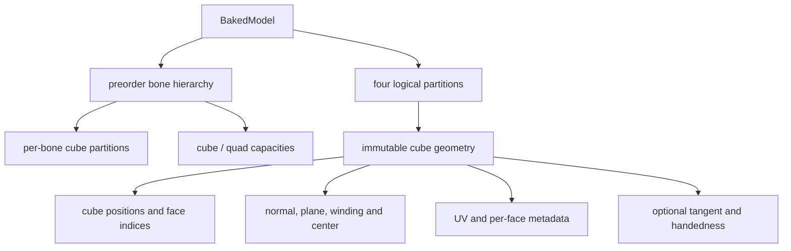

# Bake、分区与 cache

算法在独立前置的 `render-api` / `java-bake` / `java-render`。本体里的 `NativeBakedModel` 等是保留旧名的 JVM 适配器，不再加载官方 native。顶点与分区约定不变，baked cache 用独立 Java profile。见[迁移状态](../native-runtime/portable-runtime.md)。

`BakeModel` 将公开几何与基础纹理中稳定的事实转成 CPU renderer 可直接消费的不可变 `BakedModel`。它不上传纹理，不计算动画，也不决定本帧是否可见。

## 三种表示

| 表示 | 用途 | 稳定性 |
|---|---|---|
| Model Schema geometry | 跨实现交换模型语义 | 公开标准 |
| runtime `BakedModel` | 当前进程由独立 render-api 定义的不可变逻辑数据 | 内部运行时对象 |
| serialized baked cache | 校验后重建 `BakedModel` 的磁盘派生物 | 由 provider profile 版本化，可删除 |

Serialized cache 不是 runtime 内存映像、Model Schema 或 GPU buffer 格式。其兼容性由模型管理内部的私有 cache key 覆盖精确内容与派生输入，renderer 只提供 bake provider profile、UV 约定和烘焙选项等技术 profile，不接收或解释容器身份。派生物的通用存储规则见 [Storage 与 cache](../model-management/storage-and-cache.md)。

Serialized cache 的私有 manifest 直接保存完整 `GeoModel`，包括 cubes。Java 通过 QuickBuffers 的 buffer-backed view 读取该消息，不再为避免 cubes 拷贝维护独立 `GeoModelIndex` 或模型到 index 的投影；Java baked payload 仍是另一个受 cache profile 约束的 chunk。

## 核心数据关系

`BakedModel` 以稳定 preorder 保存骨骼，并记录 subtree range 以支持整棵跳过。每个 cube 只属于一个骨骼和一个逻辑分区。骨骼保存 parent/subtreeEnd；每个 cube 保存位置、quad 和剔除容量。Java renderer 按分区和可见骨骼顺序遍历，不依赖 native 调度器。

## 烘焙流程

```mermaid
flowchart LR
    I["decode and validate geometry"] --> H["validate hierarchy and build preorder"]
    H --> U["normalize versioned UV semantics"]
    U --> A["sample base-texture alpha"]
    A --> F["derive static face data"]
    F --> P["classify logical partitions"]
    P --> G["build immutable logical cubes"]
    G --> C["calculate partition capacities"]
    C --> O["BakedModel or serialized cache"]
```

`BakeModel` 校验几何与骨骼层级，并为多个 root 生成稳定 preorder 与原顺序映射；cache read 再次验证内部结构。未闭环的校验见[渲染已知问题](../../status/known-issues/rendering.md)。

UV 先按来源版本转换为最终采样语义，再参与 alpha 分类和 tangent 计算。每个 face 保留模型提供的 normal，不从 vertex winding 重新推导；同时预计算中心、平面常数和几何绕序符号，供 render 判断背面与透明深度。空面通常丢弃。完整六面 cube 会识别正常或反向几何；反向 cube 用于只显示背面或描边一类效果，不能被改写成普通外向 cube。

## 四逻辑分区

分区由透明语义与 CPU 面剔除两个轴组成。`cutout` 是历史内部名称，在这里表示 opaque，不等同于纹理 cutout；四个名称也不决定 Java 的 `RenderType`。

| 分区 | Alpha / 几何语义 | Render 行为 |
|---|---|---|
| `cutout` | 完全不透明且可安全按完整 cube 处理 | 背面剔除，直接写 opaque region |
| `cutout_no_culling` | 完全不透明，但几何不满足安全剔除条件 | 保留正反面，直接写 opaque region |
| `translucent` | UV 覆盖透明洞、部分 alpha，或被强制归入透明 | 保留正反面，写透明临时区 |
| `translucent_culling` | 透明类几何中显式允许剔除或具有反向完整 cube 语义 | 背面剔除，写透明临时区 |

Alpha 分类只读取基础 RGBA 纹理的相关 UV 区域：全透明面可删除；二值透明和部分 alpha 进入透明分区，全不透明进入 opaque 分区。`BakeModelOptions` 控制版本化 UV、PBR tangent 与强制分区，但不改写原始 normal、UV 或 winding；PBR 图片仍由 Java 与 Iris 管理。

## Tangent 与几何语义

PBR tangent 在最终 UV 上由 face 几何与 UV 梯度预计算，保存方向与 handedness；退化 UV 产生确定性结果。Render 再按最终变换修正方向、镜像和背面 handedness；Bake 不预设本帧 model matrix。

Authoring 几何及视觉保证见[geometry-regions](../../product-decisions/decisions/geometry-regions.md)。上述 normal、winding、反向 cube 与四分区映射是 Bake 的实现边界。

## AoSoA 与能力相关布局

此标题保留供旧链接定位。当前 Java baseline 不使用 AoSoA、SIMD lane 或 native ABI。
`BakedModelCodec` 序列化独立的逻辑结构，profile 为 `ysmlib-java-bake-1`，解码时重新验证
层级、分区、索引和容量。未来 accelerator 可在内部派生能力相关布局，但不得要求 Java
baseline 理解其内存地址，也不得复用不匹配的 cache profile。
