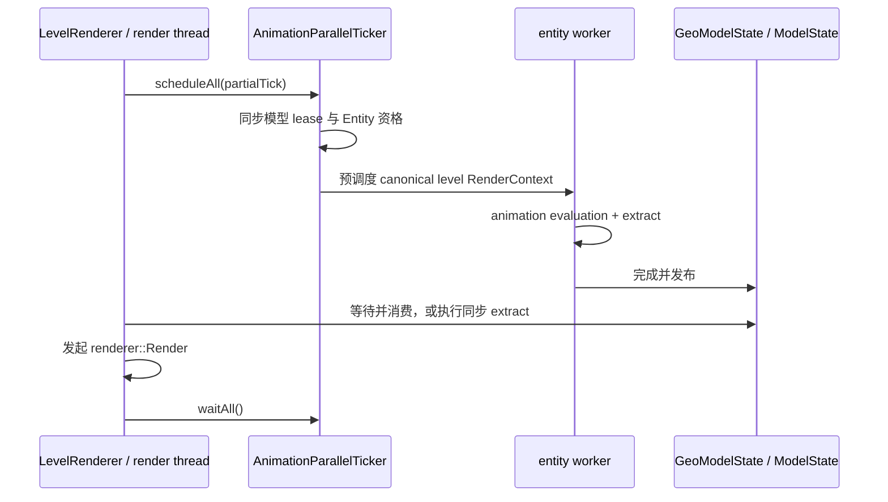

# 逐帧状态与调度

算法在独立前置的 `render-api` / `java-bake` / `java-render`。本体里的 `NativeBakedModel` / `NativeModelState` / `NativeRenderer` 是保留旧名的 JVM 适配器，不再加载官方 native。顶点与分区约定不变，baked cache 用独立 Java profile。见[迁移状态](../native-runtime/portable-runtime.md)。

`GeoModelState.extract(...)` 调用 `ModelState.extract`，把 Java [`AnimationProcessor`](../animation/processor-and-bone-output.md) 已求值的 `BoneAttribute` 转成可供一次或多次 draw 消费的逐帧状态，并计算可见骨骼列表及顶点容量。`GeoModelState` 拥有这份结果；Extract 不生成顶点，也不运行 render worker。

## 输入、输出与状态

`render-api.ModelState` 是每实体、每输出槽独占的状态接口。`JavaModelState` 持有共享的
immutable BakedModel、JOML pose/normal、可见骨骼与 locator indices、顶点容量和 generation。
`NativeModelState` 仅为本体 adapter，`BonePoseView` 每次访问检查 generation；没有 native
handle、借用地址或 SIMD 对齐要求。调用方从接口复制矩阵，不取得内部 mutable 矩阵。

Extract 首先使上一帧失效，校验并计算临时结果，全部成功才发布。它不保留输入属性数组。
失败或 close 后不能读取旧 pose。close 是终态，不能再次 extract；每次 invalidate 都改变
代数，使旧 view 明确失效。状态仍由原 GeoModelState owner 持有，不因 provider 变化改变
游戏的模型 lease 或资源生命周期。

## 层级遍历与可见性

骨骼按 `BakedModel` 的稳定 preorder 单次遍历，用可复用 pose stack 组合 parent pose、pivot、位移、ZYX rotation、scale 与反 pivot。Pivot 与 `BoneAttribute.position` 在此按模型单位转换；baked cube position 不由 Extract 统一缩放。Position 与 normal pose 分开维护；非有限属性、零 scale 或非有限结果会跳过整棵 subtree。

颜色、透明度和 glow 直接从当前 bone 的 packed attribute 复制到对应 `BonePose`，不进入 pose stack，也不从 parent 继承。非法 packed 整数或 glow 字节使 Extract 失败。

- 隐藏当前骨骼几何只影响该骨骼及其附着点；child 继续遍历。
- 隐藏子级会保留当前骨骼自身，再利用 subtree range 跳过全部后代。
- 只有未隐藏且实际拥有几何的骨骼进入 render bone 序列；正常生产路径由 preorder 构造，因此稳定且唯一。
- 附着点供 Java 原版 layer 使用；`locator_sequence` 只标记需要回传的 active bone。`ModelState.extract` 返回对应 bone indices，`GeoModelState` 据此建立 locator 到骨骼索引的映射，访问时通过当前 `BonePoseView` 读取 provider pose，不长期复制 pose records。

载具座位按模型中 `PassengerLocator` 的稳定序号选择，并通过当前 `ModelState` 应用 pose；隐藏较早的座位不重排后面的乘客。缺少座位、状态未准备或定位组隐藏时保留原版位置，不额外扣除乘坐高度。

女仆适配层从已提取帧的 active locator 复制不可变的父骨骼链、局部变换和 pivot，随该帧 `GeoRenderData` 保存。TLM layer 只在当前 draw 内取得该快照，不借用动画 worker 的属性数组；支持多组左右手，仅在模型未定义背包定位组时回退到鞘翅定位。已定义但隐藏或零缩放的背包组不会触发回退。核心动画模型不再保存 TLM 对象。

## Java 预调度与 context

每次 draw 刷新矩阵、光照、相机和 context metadata，不随 pose 复用。Java `RenderContext` 表示会影响动画、姿态或 pass 的调用环境，并决定状态是否可复用；“可复用”与“是否在 worker 执行”是两个维度：

| 路径 | 状态语义 | Extract 位置 |
|---|---|---|
| `level` entity 且满足预调度资格 | canonical `immutable`；同一逻辑帧可供多个兼容 pass 复用 | Java worker，render 时按需等待 |
| `level` entity 但未预调度 | 同样可以是 `immutable` | 渲染线程同步执行 |
| `inventory`、`paperDoll` 或 `firstPersonMod` | mutable；每次重新求值，不覆盖 canonical 槽 | 渲染线程同步执行 |
| 本地第一人称 `irisShadow` | 强制 mutable，避免复用第三人称状态 | 渲染线程同步执行 |
| GUI preview `Entity` | `immutable` 只表示同帧复用；当前未进入预调度集合 | 渲染线程同步执行 |

同一 entity 的所有 `RenderContext` 求值串行；各输出槽的 Extract、Render、resize 与释放也串行。启动新 worker、换模或释放前必须等待已有任务结束。Worker 完成与 render 消费通过任务完成关系和内存栅栏发布；当前不是 lock-free 双缓冲。Render 始终由 Minecraft 渲染线程发起。

## `RenderSchedule`

当前 Java baseline 不构造上游 native RenderSchedule。Extract 保留稳定的可见骨骼列表和
四分区顶点容量；JavaRenderer 每 draw 在本线程变换并构造完整顶点结果。opaque 在前，
透明面在尾部排序，剔除容量不足处写确定性的零顶点。它不创建额外 worker pool。

## `RenderSchedulingMode`

旧 native scheduling mode 只保留在兼容诊断配置中，不控制 JVM renderer。
游戏侧 animation/extract 预调度仍按原 RenderContext 生命周期工作。是否增加并行顶点
生成属于 provider 内部的未来性能优化，不能改变输入/输出和 owner 契约。

## 低延迟同步与并发边界

同一 ModelState 的 extract/render/close 必须串行；游戏侧等待已调度 animation task 后
消费结果。不同实体状态可以独立求值。共享 BakedModel 不可变，JavaRenderer 不持有每次
调用的 scratch 或游戏全局状态；provider 切换只能发生在新状态建立时。
