# CPU render 与顶点输出

算法在独立前置的 `render-api` / `java-bake` / `java-render`。本体里的 `NativeBakedModel` / `NativeModelState` / `NativeRenderer` 只是保留旧名的 JVM 适配器，不再加载官方 native。顶点与分区约定不变，baked cache 用独立 Java profile。模块边界和还没验过的组合见[迁移状态](../native-runtime/portable-runtime.md)。

渲染入口吃有效的 `ModelState`、`RenderParameters`、`VertexKind` 和输出区间，吐出 Minecraft 能上传的顶点。适配器决定走 direct 还是 `VertexConsumer`；JavaRenderer 负责骨骼矩阵组合、面语义和字节写入。

## 主流程

```mermaid
flowchart LR
    RT["RenderType"] --> MS["MultiBufferSource"]
    MS --> VC["VertexConsumer"]
    VC --> J["NativeRenderer"]
    J --> P["select VertexKind<br/>reserve output region"]
    P --> B["build RenderBoneState"]
    B --> W["iterate four partitions"]
    W --> C["transform and cull faces"]
    C --> O["write opaque region"]
    C --> T["write translucent scratch + depth"]
    T --> S["global far-to-near sort for this model draw"]
    S --> F["copy translucent tail"]
    O --> K["commit to VertexConsumer on success"]
    F --> K
    K --> D["Minecraft upload and draw"]
```



Java 完成 `entity` 姿态补偿、模型缩放、纹理与 `RenderType` 选择；`NativeRenderer` 再把 draw 矩阵、context、光照、overlay、颜色和 Iris entity data 适配为 `RenderParameters`。纹理像素与 GPU 句柄不传给 renderer provider。

## 变换与面语义

每个可见骨骼先形成一份 `RenderBoneState`：最终 position 变换、normal 变换、投影后面朝向系数、opaque/translucent RGBA、light，以及透明面需要的 depth 变换。Position、normal 与 clip-space 变换必须分别从上层提供的正确矩阵组合，不能从单一 4×4 matrix 猜测全部语义。

颜色、alpha 和 light 均在 `RenderState::Update` 按 bone 一次性合成，顶点循环只选择结果。每个 RGB 通道使用 `round(parent * bone / 255)`；shader 后续叠加方向光、overlay、lightmap 和 fog。Opaque/cutout 保留上层 alpha；只有 baked `translucent` 与 `translucent_culling` 分区将上层 alpha 乘以 bone alpha。Glow `-1` 保留上层 light，`0–15` 同时覆盖 block/sky light；这些属性均不向子骨骼继承。

Face 在 Bake 已保存 normal、plane、winding 和 center。Render 用最终 clip transform 判断其投影后朝向，而不是使用简单的相机方向点积：

- culling 分区丢弃 back face；double-sided 分区保留它，并反转输出 normal；
- 反向 cube 沿用其 baked winding，因此保持只显示背面一类 authoring 语义；
- 透明 depth 使用变换后 face center 的 NDC 深度，与顶点任务使用同一姿态；
- 非有限输入矩阵或骨骼变换使 Render 失败；无效方向归零，非有限透明 depth 使用 invalid sort key。

Normal 使用上层 normal matrix 与骨骼 normal pose 的组合；非均匀缩放等非保角变换在打包前归一化，Vanilla 与 Iris direct 输出均采用该规则，back face 再反转 normal。校验与视觉验收边界见[渲染已知问题](../../status/known-issues/rendering.md)。

PBR tangent 在最终 position / normal 语义下变换；非保角路径单独归一化，镜像、骨骼 determinant 与 back face 共同修正 handedness。无 PBR 时扩展格式写确定的零 tangent，不使用未初始化数据。

## `RenderType`、`renderer::RenderContext` 与 `VertexKind`

一次模型 draw 中的三者是正交维度：`RenderType` 决定 Minecraft draw state 与目标 `VertexConsumer`，`renderer::RenderContext` 是 Java `RenderContext` 的三值投影，`VertexKind` 只选择 provider 顶点布局。Iris shadow 因而不是一种 `VertexKind`。

| 输出路径 | 选择条件 | 交接语义 |
|---|---|---|
| Vanilla direct | `VertexConsumer` 提供 `VertexBufferAccessor`，布局为 `DefaultVertexFormat.NEW_ENTITY` | Java provider 写连续区域，包含 position、color、UV、overlay、light、normal |
| Iris direct | accessor 可用且 Iris layout 已识别 | Java provider 按对应版本写 entity data、mid-UV、tangent 等扩展语义 |
| `VertexConsumer` fallback | accessor 不可用或 layout 未识别 | Provider 生成 immutable 顶点列表，本体 逐顶点回放到原 `VertexConsumer` |

Fallback 中间顶点的 packed normal 从低字节起依次保存 X、Y、Z，以 ±127 编码；Java 按 signed byte / 127 解码后交给 `VertexConsumer`。编码与解码约定匹配，完整路径的视觉等价仍需实机验收。

Direct 路径预留连续区域并只在 provider 成功后提交；fallback 也只在成功后回放，不产生部分模型顶点。失败降级缺口见[渲染已知问题](../../status/known-issues/rendering.md)。

`VertexBufferAccessor.ysm$reserve` 的参数单位是顶点，Minecraft `ensureCapacity` 的单位是
字节；adapter 按当前 format 的 stride 做 checked multiplication，再按完整字节数扩容、
切片。预留不推进计数，只有写入成功后才 advance。Fallback 不调用 direct reserve，
由 `VertexConsumer` 自己管理容量。回归测试使用 Minecraft 实际扩容器覆盖超过 2 MiB 的
单次输出、多模型累积偏移与扩容后的已有数据保留。

## 顶点输出区间与 translucent 排序

最终逻辑布局为：

```text
[cutout][cutout_no_culling][translucent + translucent_culling tail]
```

JavaRenderer 分别收集 opaque 与 translucent quads，并记录每个透明 quad 的 face-center depth；变换全部完成后按本次模型 draw 全局远到近排序，然后生成完整 immutable 顶点列表。剔除留下的未写容量会清零并标记 invalid；depth 非有限的已写 quad 保留并排到末尾。

Iris shadow 不执行透明排序，保持生成顺序。跨 draw 的混合由 Minecraft 上层管线决定，保证范围见[transparency-scope](../../product-decisions/decisions/transparency-scope.md)。Java 外层关闭模型局部 culling 与 upload-time sorting 的重复处理，使 provider 的面剔除与单模型透明排序成为唯一来源；主渲染入口在 provider translucent vertex count 非零时选择 translucent `RenderType`。

## SIMD 分派

当前 Java baseline 不做 native SIMD 分派，所有布局共享同一组语义顶点。
`Renderer.write` 对 VANILLA、IRIS_54、IRIS_55、IRIS_56、IRIS_56_AR 按显式 stride/offset
写 little-endian bytes 并清零 padding；写入前验证完整容量。本体 direct 路径在成功后
advance，fallback 逐顶点调用 VertexConsumer。扩展布局的实际 shader/GPU 行为仍应按
[迁移验收范围](../native-runtime/portable-runtime.md) 检查，字节布局测试不等于完整 shader
视觉等价证明。
